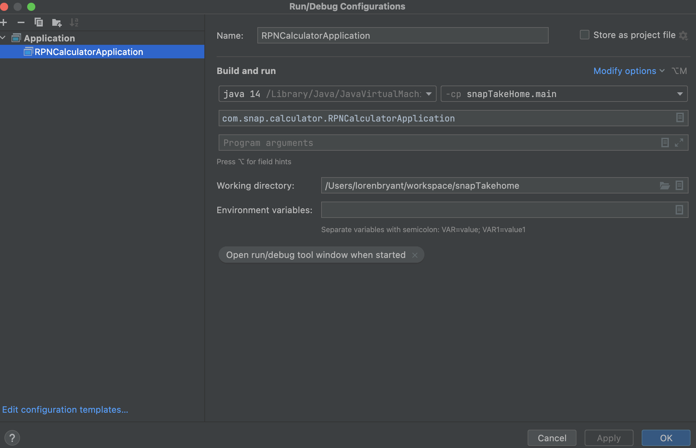

# snapTakeHomeTest
<h2>RPN Calculator</h2>

<B><h4> Description: </h4></b> <i>RPN calculator that allows 4 different operands using a CLI to take in inputs.
Uses loops and java LIFO Stack to traverse over eahc input and operate accordingly,
based on the kind of input char(s) are sent to the app.</i>

<B><H4> Reasons Behind Tech Choices: </H4></B>
Allows for easy addition of other operands by separating operand 
functionality from main logic. Stack usage makes it easy to follow the RPN
flow of LIFO(Last in First Out). Explicit definitions of operands
make customization possible as well as more readable code to a novice.

<B> <H4> Trade-offs: </H4></B>
Code could be more concise if lines of code are an issue(no need for Operations class). 
Loss of easy readability as well as customization and clean structure which makes
adding code in the future a lot more messy.

<B><H4>How To Run Code:</h4></B>
Simply create a run configuration as shown below in intellij or
similar IDE. Click the RUN button.

<B><H4> Link to Github: </H4></B>
<a href="https://github.com/nutechmobile/snapTakeHomeTest" target="_blank">snapTakeHomeTest</a>